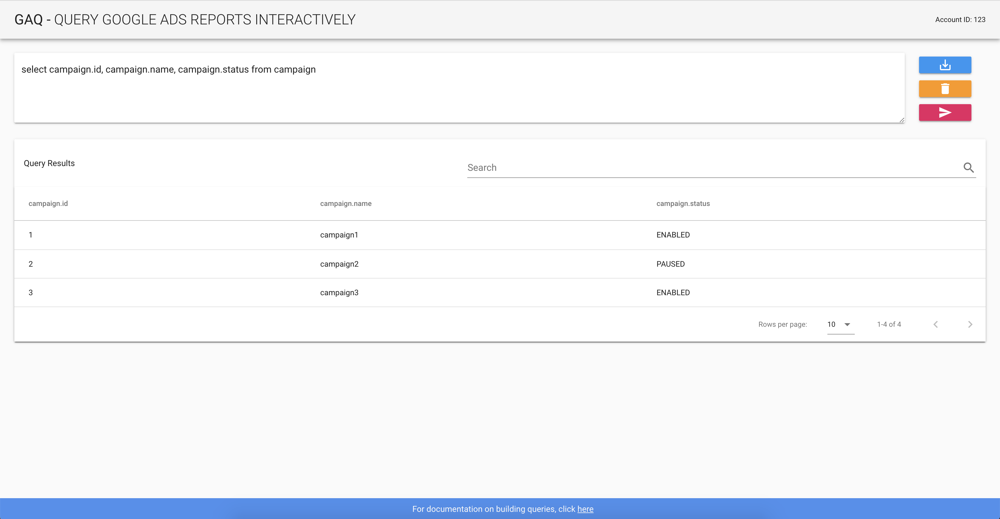

# GAQ
A web UI for querying the [Google Ads Reporting API](https://developers.google.com/google-ads/api/docs/reporting/overview) 

## Screenshots


## Running the app

1. Ensure Docker is installed on your computer. If it is not, download and install it.

2. Clone the repository on your filesystem.

   ```bash
   git clone https://github.com/mikeengland/gaq.git
   ```

3. Launch the application in Docker. 

The following variables need to be set in your environment to allow the app to connect to Google Ads.
These settings match your normal Google Ads OAuth authentication credentials.

* GAQ_CLIENT_ID
* GAQ_CLIENT_SECRET
* GAQ_REFRESH_TOKEN
* GAQ_DEVELOPER_TOKEN

Either set these on the same line as the docker-compose command, or export them.
```bash
GAQ_CLIENT_ID=xyz GAQ_CLIENT_SECRET=xyz GAQ_REFRESH_TOKEN=xyz GAQ_DEVELOPER_TOKEN=xyz docker-compose up

# or if you have exported these variables in your environment:

docker-compose up
```

The application should then be accessible at http://127.0.0.1:8080/

For help building queries, the Google Ads documentation provides a useful
[interactive query builder](https://developers.google.com/google-ads/api/docs/query/interactive-gaql-builder).

## Disclaimer
This is an early version of the application. Currently it is only suitable for running locally.
Expect changes in the future! 

## Future improvements / TODOs
- Add tests!!
- Use a non-default favicon
- Production Docker setup
- Disable buttons if no query entered
- Improve error handling - currently the app just handles Google Ads JSON errors
- Look at supporting Google Ads pagination - https://developers.google.com/google-ads/api/docs/concepts/retrieving-objects#paging_through_results
- Stored queries
- Query building assistance
